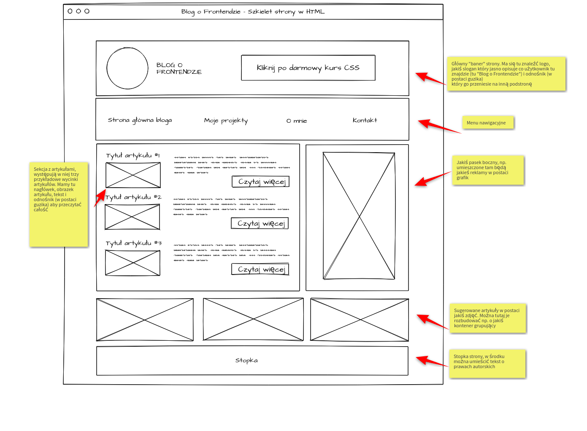
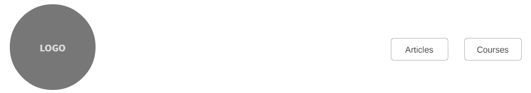
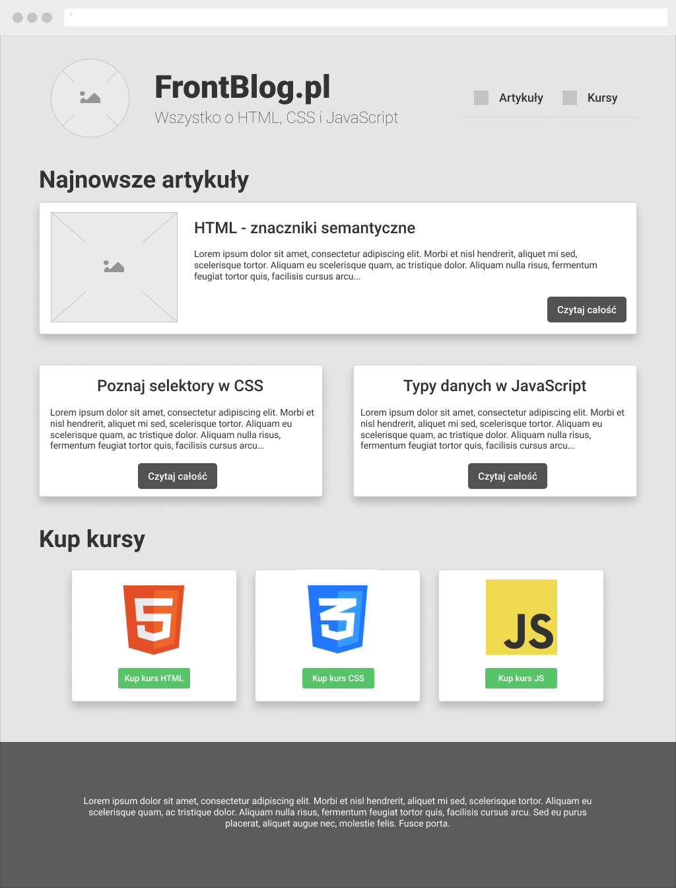
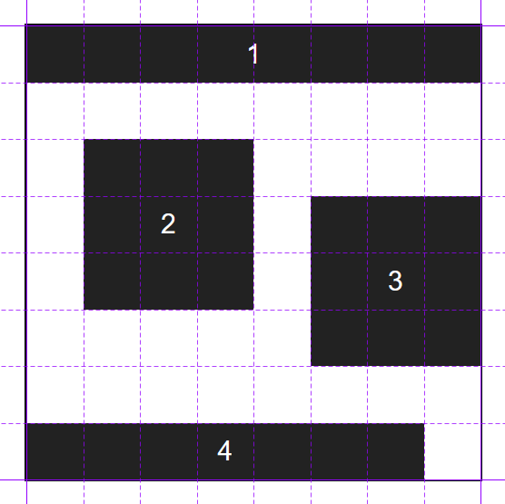

# HTML & CSS Workshops at infoShare Academy

👨‍🏫 Dominik Młynarczyk | 📧 [hello@dominikmlynarczyk.com](mailto:hello@dominikmlynarczyk.com)

## 🚀 Startujemy! Wprowadzenie, narzędzia, podstawy języka HTML

Na tych zajęciach zapoznamy się z narzędziami wykorzystywanymi w codziennej pracy *Frontend Developera*. Pomówimy o:

- **💻 Visual Studio Code** - edytor kodu i środowisko w którym będziecie pracować przez cały *bootcamp* (i prawdopodobnie po nim także 😉). Omówimy skróty klawiszowe, najważniejsze wtyczki, zarządzanie plikami i więcej...
- **🌐 Google Chrome DevTools**, czyli narzędzia developerskie w przeglądarce. Skupimy się na zakładkach *Elements*, *Network*, *Sources*, *Lighthouse* oraz zaanonsujemy zakładkę *Console*. 
- **📄 HTML** - omówimy podstawy języka HTML i spróbujemy zakodować *markup* strony (bez użycia stylów CSS) przedstawionej w postaci szablonu graficznego.

> Jeśli ktoś chce, to już przyszłościowo może zainstalować [Node.js](https://nodejs.org/en/) - jest to środowisko uruchomieniowe kodu *JavaScript* i będzie ono przydatne dla Was dużo później w kursie. **Nie jest to zupełnie konieczne w ramach warsztatów HTML i CSS,** ale jeśli ktoś chce mieć już "spokój" z instalacją narzędzi to może "awansem" pójść krok dalej  🤗 (interesuje nas wersja LTS, instalacja to klasyka gatunku - nic nowego). 

### Garść linków na dzień dobry 🧐

1. [MDN](https://developer.mozilla.org/en-US/) - jest to serwis organizacji *[Mozilla](https://www.mozilla.org/en-US/)* uruchomiony w roku 2005, którego celem jest dokumentowanie standardów sieciowych, w tym języków HTML, CSS i JavaScript. Nie należy jednak mylić *MDN* z oficjalnymi dokumentacjami / specyfikacjami tych języków których tworzeniem zajmują się organizacje [W3C](https://www.w3.org/), [WHATWG](https://whatwg.org/), czy w przypadku JS komitet [TC39](https://tc39.es/).

   Na tym etapie nauki korzystanie z oficjalnych specyfikacji nie będzie najefektywniejszym rozwiązaniem, ponieważ język tam używany może być trudny dla początkujących, *MDN* jest znacznie lepszym rozwiązaniem i w praktyce większość *developerów* szukając informacji korzysta z *MDN*, informacje tam są jasno, treściwie przekazane i najczęściej jest to najlepsze źródło informacji.

   **UWAGA:** Korzystajcie z MDN w języku angielskim, wybrane zagadnienia posiadają polskie tłumaczenia, ale są najczęściej bardzo niedokładne lub mocno "okrojone".

2. [MDN HTML](https://developer.mozilla.org/en-US/docs/Web/HTML) - interesują nas sekcje [*Beginner's tutorials*](https://developer.mozilla.org/en-US/docs/Learn/HTML), czyli przyjazne poradniki wprowadzające do języka, a następnie ugruntowanie wiedzy z wykorzystaniem *[MDN HTML reference](https://developer.mozilla.org/en-US/docs/Web/HTML/Reference)*.

3. [Historia frontendu](https://piecioshka.pl/historia-front-endu/) - świetny *timeline* autorstwa [Piotra 'piecioshki' Kowalskiego](https://piecioshka.pl/), warto przejrzeć ten (mocno skrócony) przegląd rozwoju *frontendu* na którym zaznaczone są istotne momenty rozwoju technologii webowych (mało tam HTML i CSS, ale troszkę się doszukamy). Dla chętnych zostawiam [thehistoryoftheweb.com](https://thehistoryoftheweb.com/timeline/) - tam już dużo więcej wydarzeń :)

4. ["Tabela okresowa HTML"](https://codepen.io/huijing/full/wOXzNx) - jeśli ktoś ma złe wspomnienia z zajęć Chemii w szkole, to proszę nie wchodzić. 🤢🤮

   Całkiem poważnie - bardzo fajnie przedstawione znaczniki HTML z podziałem na "kategorie".

   Inne przykłady tego typu: [1](https://websitesetup.org/html5-periodical-table/) [2](https://madebymike.github.io/html5-periodic-table/)

### Challenge 1 - Przygotowanie do pracy w Visual Studio Code

W ramach tego wyzwania wykonaj wszystkie poniższe kroki:

1. Utwórz plik HTML, a następnie go usuń na trzy sposoby:

   1. Z poziomu eksploratora systemowego (GUI).
   2. Z poziomu linii poleceń na podstawie poznanych komend na zajęciach.
   3. Z poziomu *Visual Studio Code* za pomocą skrótów klawiszowych i/lub GUI.

   Dodatkowo utwórz katalog, sprawdź zawartość danego katalogu, przenieś plik, przekopiuj go za pomocą linii poleceń.

2. Przetestuj działanie wbudowanych skrótów klawiszowych (poniżej przykłady dla *Windows*, na macOS zamień `CTRL` na `CMD` - w większości przypadków powinno zadziałać) i za ich pomocą:

   1. Utwórz i usuń wcięcia w kodzie - `Ctrl+[` oraz `Ctrl+]`
   2. Zwiń i rozwiń zagnieżdżony kod HTML - `Ctrl+Shift+[` oraz `Ctrl+Shift+]`
   3. Przenieś wybraną linię/fragment kodu w górę lub dół - `Alt+Up` oraz `Alt+Down`
   4. Usuń wybraną linę/fragment kodu - `Ctrl+Shift+K`
   5. Wykorzystaj multi kursor np. do określenia wspólnej treści dla kilku znaczników. 
   6. Utwórz kilka przykładowych plików w katalogu, a następnie wyszukaj plik za pomocą `Ctrl+P`. Po wyszukaniu przenieś się do wybranego pliku.

3. Uruchom paletę poleceń *Visual Studio Code* za pomocą skrótu `Ctrl+Shift+P` i wpisz `Open Settings (JSON)`, następnie wybierz tę opcję z listy. Powinieneś zobaczyć plik `settings.json` który jest plikiem konfiguracyjnym edytora VSCode, wyjściowo będzie tam pusty obiekt konfiguracyjny, wprowadź wewnątrz niego następującą linijkę kodu:

   ```json
   "editor.formatOnSave": true
   ```

   Dzięki temu domyślne narzędzie formatujące kod HTML w Visual Studio Code, czyli *HTML Language Features* będzie zapisywać kod przy każdym zapisaniu pliku.

   > W przyszłości zainstalujesz i skonfigurujesz rozszerzenie/wtyczkę [Prettier](https://prettier.io/) - pozwala ona na zaawansowaną konfigurację formatowania kodu i jest powszechnie używana przez programistów JavaScript.
   >
   > Możesz doczytać na ten temat już teraz, ale w ramach *bootcampu* przewidziane są zajęcia gdzie to narzędzie będzie omówione. 🤗

   

4. Sprawdź działanie wbudowanego narzędzia w VSCode o nazwie ***Emmet*** używając poznanych na zajęciach skrótów.

   > Więcej informacji o *Emmecie* w [oficjalnej dokumentacji](https://docs.emmet.io/)
   >
   > Polecam też ten [Cheat Sheet](https://docs.emmet.io/cheat-sheet/) 

   

5. Upewnij się, że masz zainstalowaną wtyczkę *Live Server* w *Visual Studio Code* uruchamiając lokalny serwer kierujący do dowolnego pliku HTML.

### Challenge 2 - Zapoznanie z narzędziami developerskimi

Na podstawie informacji o *devtools* z zajęć wykonaj następujące kroki:

1. Za pomocą zakładki *Elements* dodaj dynamicznie elementowi klasę, zmodyfikuj kod HTML, usuń element z tzw. drzewa DOM. Następnie przetestuj pracę z panelem *Styles* dodając dynamicznie style "inline", a także dodając klasę.

   Możesz też zobaczyć "wyliczone" wartości stylów CSS w zakładce *Computed*.

2. Za pomocą zakładki *Console* wykonaj w środowisku przeglądarki dowolny kod *JavaScript*.

3. Wykorzystaj zakładkę *Network* do sprawdzenia pobierania zewnętrznych zasobów. Dołącz zewnętrzny plik CSS, grafikę i sprawdź w tej zakładce statusy odpowiedzi, rozmiar plików i inne informacje które dostarcza nam przeglądarka dla każdego z ładowanych zasobów.

   Przetestuj jak zakładka *Network* reprezentuje informacje o zasobach w momencie ładowania ich z lokalnego serwera, a jak w momencie kiedy zasoby ładowane są z dysku.

4. Przetestuj działanie zakładki *Lighthouse* i sprawdź czy Twoja wyborna witryna spełnia wymogi dostępności, optymalizacyjne, SEO itp. 😂

### Challenge 3 - Podstawy HTML i Globalne atrybuty *id* oraz *class*

Wykorzystaj poznaną wiedzę z zajęć i wykorzystując poznane znaczniki przygotuj prosty kod HTML reprezentujący wybrany przez siebie komponent strony internetowej. Może to być zajawka wpisu blogowego, nawigacja strony, panel boczny itp.

Jeżeli jesteś w stanie, dodać globalny atrybut klasy do elementów i nadaj im podstawowe style. Możesz też wykorzystać globalny atrybut `id`.

Upewnij się, że rozumiesz też kod w sekcji `<head>` strony i jeśli chcesz możesz spróbować wykorzystać dodatkowe znaczniki dla tej sekcji np. *OpenGraph*.

## 📄 Markup przykładowej strony, semantyka, formularze

Drugie zajęcia to:

- 📄 **Pierwsza strona** - "ubrudzenie" rąk w HTML, czyli przepiszemy szablon graficzny do *markup* HTML.
- ➡️ **Semantyka** - poznanie znaczników semantycznych i ich zastosowanie
- **📄 Formularze w HTML** - konstrukcja formularzy, przegląd możliwych pól formularza, a także sposobów przesyłania danych z formularza do serwera

### Garść linków na dzień dobry 🧐

- [Markup Validation Service](https://validator.w3.org/) - walidator HTML wskaże nam błędy i ostrzeżenia co do jakości naszego kodu HTML. Traktujmy to jak dodatkowe narzędzie, a nie wyznacznik jakości - niektóre ostrzeżenia czy nawet błędy które walidator wskaże można zignorować. (na starcie warto jednak często kod sprawdzać za pomocą tego narzędzia)
- [Ściągawka znaczników semantycznych](https://learn-the-web.algonquindesign.ca/topics/html-semantics-cheat-sheet/)
- [Ślepnąc od DIVów](https://www.youtube.com/watch?v=6_75wo-CDrc) - totalnie *me gusta* jeśli chodzi o tutoriale, dużo merytorycznej treści, ale też humorystyczny aspekt. Tutaj temat poświęcony semantyce HTML. Wideo to jest zrealizowane w stylu angielskiego kanału [Fireship](https://www.youtube.com/channel/UCsBjURrPoezykLs9EqgamOA), który jest dla mnie *the top of the top*.
- [Semantyczny blog w HTML, autorstwa Tomka Jakuta](https://tutorials.comandeer.pl/html5-blog.html#start) - jest tutaj wiele historycznych już elementów/konstrukcji języka HTML, wiele znaczników też będzie dla Was niejasne, ale uważam, że przeczytanie tego w całości jest nadal dużą wartością studiując temat semantycznego kodu
- Wybrane artykuły na temat semantycznych znaczników: [1](https://www.freecodecamp.org/news/semantic-html5-elements/) [2](https://html.com/semantic-markup/)
- [MDN Form](https://developer.mozilla.org/en-US/docs/Learn/Forms) - informacje o budowie formularzy w HTML

### Challenge 1 - Pierwszy *markup* HTML

Twoim zadaniem jest przygotowanie kodu HTML który odtworzy wygląd strony przedstawiony na poniższej grafice:



Elementy oznaczone za pomocą X to docelowo elementy multimedialne, tutaj niech będą to przykładowe zdjęcia (podobnie koło, które ma reprezentować logo serwisu). Na tym etapie zakładam, że nie znasz semantycznych znaczników grupujących treści, więc "opakuj" wybrane sekcje strony w znaczniki `<div>`.

**UWAGA:** Skup się jedynie na przygotowaniu *markupu* HTML który wyrazi strukturę powyższej strony. Kiedy poznasz CSS i techniki tworzenia układów strony (*layouts*) będziesz mógł próbować odtworzyć już wizualnie powyższy szablon.

Opisy w "żółtych karteczkach" - jeśli są niewidoczne to luzik arbuzik 🍉🍉🍉, zignoruj te opisy! Gdyby jakiś element szablonu graficznego był niezrozumiały, pytaj śmiało.

### Challenge 1* - dla chętnych 🤓

Spróbuj przygotować skrót *Emmet'a* po którego rozwinięciu klawiszem TAB zostanie wygenerowana poprawna struktura kodu HTML dla powyższego *layoutu*. Challenge accepted? 😎

### Challenge 2 - Użycie znaczników semantycznych

Na podstawie poznanych znaczników semantycznych zrefaktoruj (usprawnij) poprzedni kod wykorzystujący znaczniki `<div>`.

### Challenge 3 - Formularz w HTML

Przygotuj formularz kontaktowy który umożliwi użytkownikowi wprowadzenie następujących danych:

1. Imię i nazwisko, spraw aby były to pola wymagane
2. Temat formularza, zdefiniuj wyjściowo wartość i zablokuj to pole formularza
3. Email, spraw aby było to pole wymagane
4. Numer telefonu
5. Wiek użytkownika
6. Hasło
7. Pole wyboru daty
8. Pole wyboru (lista rozwijana)
9. Pola typu *checkbox* 
10. Pola typu *radio button*
11. Adres URL
12. Plik graficzny
13. Ukryte pole (możesz je dowolnie określić, nie musi to być "sensowne"/praktyczne użycie tego pola)
14. Pole wielowierszowe
15. Guzik przesyłający formularz i czyszczący formularz

Upewnij się, że formularz prześle dane metodą `POST` (możesz zweryfikować zachowanie formularza przy użyciu metody `GET`).

Pamiętaj o etykiecie dla każdego pola formularza, samą zawartość etykiety zostawiam Twojej inwencji twórczej :)

Możesz dodać dodatkowe pola do formularza wedle własnego uznania, np. umożliwiając wybór z palety kolorów. 

## 🎨 Wstęp do CSS, podstawowe selektory

Na tych zajęciach omówimy następujące tematy:

- **🐾 Podstawy CSS** - selektory, czyli możliwość "dostania się" do elementu HTML na różne sposoby w celu wystylizowania go. Pokażemy też podstawowe pseudoklasy i pseudoelementy.

  [](https://camo.githubusercontent.com/b37f1c9902b418550c7155c0a8561b5140ec304a38640e57caf256aeda2281df/68747470733a2f2f6d65646961342e67697068792e636f6d2f6d656469612f313346727065564830395a7262322f67697068792e676966)

- **🌈 Kolory i typografia** - omówimy podstawową pracę z kolorami i stylizacją tekstu w CSS

### Garść linków na dzień dobry 🧐

- [MDN Form](https://developer.mozilla.org/en-US/docs/Learn/Forms)
- [MDN CSS](https://developer.mozilla.org/en-US/docs/Web/CSS)
- [MDN CSS Selectors](https://developer.mozilla.org/en-US/docs/Learn/CSS/Building_blocks/Selectors)
- [Meet the Pseudo Class Selectors](https://css-tricks.com/pseudo-class-selectors/) - artykuł na portalu CSS Tricks stanowiący fajne wprowadzenie do tematyki pseudoklas w CSS.
- [Can I Use?](https://caniuse.com/) - niezbędnik *frontendowca*, znajdziemy tutaj informacje o wsparciu przeglądarek dla różnych właściwości / modułów (szerzej) CSS, a także informacje o wsparciu dla konstrukcji języka JavaScript czy różnego rodzaju tzw. *API*
- [CSSReference.io](https://cssreference.io/) - szybka ściągawka właściwości CSS, autor [Jeremy Thomas](https://cssreference.io/)

### Challenge 1 - Podstawy CSS

[](https://camo.githubusercontent.com/cbcf99e79bd71114b2e7677fefd76790bd06910fb33b416c477a63020987d3ae/68747470733a2f2f69322e77702e636f6d2f6373732d747269636b732e636f6d2f77702d636f6e74656e742f75706c6f6164732f323031372f30352f6373732d72756c657365742d7465726d696e6f6c6f67792e706e673f73736c3d31)

> [Źródło obrazka](https://css-tricks.com/css-basics-syntax-matters-syntax-doesnt/)

Na podstawie poznanych właściwości CSS wykonaj poniższe ćwiczenia:

1. Dodaj style CSS do tego samego elementu (ta sama właściwość, ale różna wartość) na trzy sposoby - *inline*, za pomocą arkusza wewnętrznego i za pomocą arkusza zewnętrznego. Zastanów się który styl zostanie zaaplikowany i pomyśl dlaczego.

2. Przećwicz wybieranie elementów za pomocą klasy oraz ID aplikując różne deklaracje CSS

3. Na bazie wiedzy z zajęć wybranym elementom ustal:

   - kolor tła (możesz użyć słowa kluczowego czy zapisu w dowolnym systemie reprezentacji koloru)
   - kolor czcionki (możesz użyć słowa kluczowego czy zapisu w dowolnym systemie reprezentacji koloru)
   - wielkość czcionki
   - styl czcionki (pogrubienie, kursywa)
   - pogrubienie czcionki
   - krój czcionki
     - wykorzystaj czcionki "niesystemowe"
   - rozstrzelenie liter i słów
   - przekształcenie liter, czyli spraw litery wybranego elementu były pisane drukowanymi literami, tylko małymi literami i aby pierwsza litera w każdym wyrazie była pisana z dużej litery
   - dekorację tekstu, czyli podkreślenie / przekreślenie / "nadkreślenie"
   - wcięcie tekstu
   - wyrównanie tekstu
   - wysokość wiersza

   Postaraj się użyć też właściwości skrótowej `font`.

   ------

   Jeśli zapomniałeś/aś danej właściwości spróbuj znaleźć ją samodzielnie pytając wujka *Google*, *MDN* czy szukając na [CSSReference.io](https://cssreference.io/)

### Challenge 2 - Trening użycia selektorów

To wyzwanie to tzw. "jeden z dziesięciu" 😅Na repozytorium w katalogu `03-css-intro-and-selectors` znajdziesz katalog `selectors-training`. W nim znajdziesz polecenia i przygotowane katalogi dla każdego ćwiczenia.

Głównym celem tych ćwiczeń jest przetrenowanie wybierania elementów w CSS nie tylko za pomocą klasy lub ID, ale z wykorzystaniem struktury dokumentu HTML i relacji elementów.

> Samodzielnie możesz rozszerzyć to ćwiczenie we własnym zakresie o poznane pseudoklasy wybierające element np. na podstawie "kolejności dziecka" itp.

## 🌊 Kaskadowość, model pudełkowy, jednostki w CSS

W ramach kolejnego weekendu zajęciowego czekają na nas następujące tematy:

- **🌊 Kaskadowość i dziedziczenie**, czyli poznamy zasady jakimi kieruje się CSS

- **📦 Model pudełkowy**, po angielsku *box-model*, czyli w skrócie zrozumiemy poniższy obrazek:

  

  > [Źródło zdjęcia](https://twitter.com/kvlly/status/1159263383058862081)

  

- **📐 Jednostki w CSS**, ponieważ w CSS możemy korzystać nie tylko z pikseli 😉

### Garść  linków na dzień dobry 🧐

- [MDN Cascade and inheritance](https://developer.mozilla.org/en-US/docs/Learn/CSS/Building_blocks/Cascade_and_inheritance)

- [The C in CSS](https://css-tricks.com/the-c-in-css-the-cascade/) - bardzo przystępnie napisany artykuł odnośnie działania kaskadowości w CSS

- Jeśli ktoś chce naprawdę mieć pełne rozumienie tematu kaskadowości w CSS odsyłam tutaj wyjątkowo do dokumentacji:

  - [W3C - Kryteria kaskadowości](https://www.w3.org/TR/css3-cascade/#cascade-sort)
  - [W3C - Pochodzenie arkusza z punktu widzenia kaskady](https://www.w3.org/TR/css3-cascade/#cascade-sort)
  - [W3C - Dziedziczenie](https://www.w3.org/TR/css3-cascade/#cascade-sort)

- [Specificity Calculator](https://specificity.keegan.st/) - bardzo użyteczne narzędzie do sprawdzania specyficzności wybranego selektora (do VSCode ta funkcja jest wbudowana, najedź na selektor i sprawdź jego specyficzność)

- Specyficzność na obrazku:

  

  > [Źródło obrazka - Stuff & Nonsense](https://stuffandnonsense.co.uk/archives/css_specificity_wars.html)

- [MDN Box model](https://developer.mozilla.org/en-US/docs/Learn/CSS/Building_blocks/The_box_model) - omówienie modelu pudełkowego w CSS

- [Understanding the CSS Box-Model](https://medium.com/cssclass-com/understanding-the-css-box-model-97e4228670d6) - świetny artykuł [Elada Schechtera](https://eladsc.com/), polecam wszystkie materiały tego człowieka o CSS

- [CSS is Awesome](https://css-tricks.com/css-is-awesome/), bardzo fajny artykuł na portalu CSS-Tricks rozkładający na czynniki pierwsze poniższy "żart"/mem:

  

- [Zweryfikuj swoją wiedzę o modelu pudełkowym 😉](https://css-tricks.com/which-css-is-awesome-makes-the-most-sense-if-you-dont-know-css-well/) - sprawdź *tweeta* który jest wbudowany do artykułu/postu i nie sprawdzając rozwiązania i analizy przypadku zastanów się, czy wiesz które rozwiązanie domyślnie zaaplikuje przeglądarka na podstawie zasad działania CSS

- [Margin Collapse in CSS: What, Why, and How](https://medium.com/@joseph0crick/margin-collapse-in-css-what-why-and-how-328c10e37ca0) - dziwności CSS część 1 😂, artykuł ten dość dobrze opisuje problematykę "zjawiska" *margin collapsing*

- [CSS Logical Properties*](https://medium.com/@elad/new-css-logical-properties-bc6945311ce7) - artykuł dla chętnych mówiący o tym, że można inaczej niż `margin-top`, `margin-right`, `margin-bottom` i `margin-left` 😉

- [MDN Values and units](https://developer.mozilla.org/en-US/docs/Learn/CSS/Building_blocks/Values_and_units) - informacje na temat dostępnych jednostek i ich użycia w CSS

### Challenge 1 - Kaskada 

Na podstawie materiałów z zajęć przetestuj we własnym zakresie zasady kaskadowości i dziedziczenia. Powinieneś samodzielnie:

- Wykorzystać dziedziczenie np. właściwości `color` i zrobić to "wielo-poziomowo". Spraw aby dziedziczenie się nadpisywało kilkukrotnie, aż do bezpośredniego rodzica.
  - Wiedząc, że nie wszystkie właściwości są dziedziczone zweryfikuj wartości wybranych właściwości
- Sprawdzić jak specyficzność wpływa na kaskadę, czyli przetestuj wszystkie poznane selektory (włącznie z pseudoklasami, pseudoelementami czy selektorami atrybutu) i sprawdź jak style są nadpisywane
- Sprawdzić czy kombinatory `>`, `+`, `~` mają wpływ na specyficzność selektorów
- Sprawdzić specyficzność selektora uniwersalnego (`*`) i zastanów się czy rozumiesz skąd wynika jego specyficzność
- Wykorzystać kolejność selektorów aby dla równych specyficznie reguł zweryfikować działanie zasad kolejności

### Challenge 2 - Box model

Wykorzystując wiedzę z zajęć utwórz trzy elementy `<div>` na stronie i:

1. Określ wymiary (w pikselach), kolejno:
   1. `200px` szerokość i `200px` wysokość
   2. `300px` szerokość i `100px` wysokość
   3. `150px` szerokość i `300px` wysokość
2. Określ *padding* każdego elementu, kolejno:
   1. góra `100px`, prawo `150px`, dół `100px`, lewo `150px`
   2. góra `50px`, prawo `75px`, dół `100px`, lewo `75px`
   3. dla każdego kierunku `100px`
3. Nadaj obramowanie elementów według własnego uznania - upewnij się jednak, że każdy element dostał inny styl obramowania, kolor i grubość
4. Określ margines dla każdego elementu według własnego uznania - upewnij się jednak, że margines górny i dolny, będzie dla każdego elementu inny.
5. Przeanalizuj w *devtools* jak zachowały się pionowe marginesy i postaraj się rozwiązać problem "zapadających" się marginesów
6. Sprawdź czy elementy `<div>` zachowały swoje wyjściowe rozmiary określone w podpunkcie pierwszym, jeśli nie to na podstawie wiedzy z zajęć użyj właściwości która "przywróci" określone wymiary.
7. Utwórz element "liniowy" i spróbuj określić mu właściwości składające się na model pudełkowy, zweryfikuj czy w pełni Ci się to udało.
8. Dodaj większą ilość tekstu do elementów `<div>` i zaobserwuj efekt w przeglądarce. Rozwiąż ten problem dla każdego elementu `<div>` w inny sposób przy pomocy poznanej właściwości na zajęciach.

### Challenge 3 - Jednostki CSS

Do kodu z poprzedniego ćwiczenia dodaj poznane jednostki:

- procent
- `em` i `rem`
- `vh` i `vw`
- `vmin` i `vmax`

Dodatkowo do wybranego diva określ szerokość bazową procentowo, ale także określ wartość szerokości minimalną i maksymalną.

## 🧱 Układ elementów na stronie - Flexible Box Module (Flexbox)

Głównym tematem tych zajęć będzie "szlifowanie" wiedzy dotyczącej budowy układu stron z użyciem *Flexbox'a*:

- **🐸 Flexbox** - *Flexbox* to potoczna nazwa na *CSS Flexible Box Layout*, czyli moduł CSS którego celem jest zdefiniowanie *box modelu* zoptymalizowanego dla UI i umożliwienie tworzenia układów strony zarządzając tzw. osią główną i osią "poprzeczną". Mówi się, że *Flexbox* jest układem jednowymiarowym, ponieważ główny nacisk na układanie elementów postawiony jest na osi głównej. Poznamy w nadchodzących zajęciach *CSS Grid Layout* który jest układem dwuwymiarowym.


### Garść  linków na dzień dobry 🧐

- [MDN Flexbox](https://developer.mozilla.org/en-US/docs/Learn/CSS/CSS_layout/Flexbox) informacje o wybawcy *frontendowców* od `float` i `display: inline-block`, czyli *Flexboxie*
- [A Complete Guide to Flexbox](https://css-tricks.com/snippets/css/a-guide-to-flexbox/) - *must-have* do przeczytania zaczynając naukę *Flexboxa*
- [Flexbox Froggy](https://flexboxfroggy.com/) - niepozorne żabki i staw, a po przerobieniu 24 poziomów poziom wiedzy o *Flexboxie* szybko urośnie :)
- [Flexbox Defense](http://www.flexboxdefense.com/) - jak żabki to za mało, to tutaj gra typu *Tower Defense* :)
- [Flexbox Zombie](https://mastery.games/flexboxzombies/) - "miałeś się uczyć, a Ty tylko grasz!" 🤣

### Challenge  1 -  Flexbox, trening budowy *layoutów*

Czas na przećwiczenie Flexboxa!

Na podstawie przykładu pokazanego na zajęciach, przygotuj kilka kontenerów w których będziesz testował/testowała działanie *Flexboxa*:

1. W pierwszym kontenerze przygotuj kilka elementów `<div>` którym określisz "sztywne" wymiary, następnie wykorzystaj poznane właściwości do zmiany położenia na osi głównej i osi prostopadłej.  
2. W drugim kontenerze postąp dokładnie analogicznie z tym, że dla tego kontenera spraw, aby osią główną była oś pionowa.

To nie koniec zadania! Przetestuj co się stanie, kiedy określisz większy wymiar dzieciom kontenera *Flex* niż sam kontener jest w stanie pomieścić. Następnie spraw aby te elementy zaczęły się "zawijać" do nowego wiersza/kolumny (w zależności od kontenera), przetestuj wtedy układanie wielu wierszy/kolumn za pomocą właściwości `align-content`.

Następnie popracuj z właściwościami dostępnymi na *flex items* (dzieciach), zacznij je proporcjonalnie zwiększać, "kurczyć", zmieniać ich kolejność. Sprawdź także jaka jest różnica pomiędzy właściwością `flex-basis`, a `width` i `height` (dla obu kontenerów). Wypozycjonuj wybrany element na osi prostopadłej inaczej niż pozostałe elementy.

Wykorzystaj zapisy skrótowe zarówno dla kontenera jak i dla dzieci.

### Challenge 2 - Flexbox szachownica

Wykorzystując *Flexboxa* utwórz "szachownicę" 3x3 - "pola" nieparzyste powinny być koloru białego, a pola parzyste koloru czarnego.

### Challenge  3 - Flexbox nawigacja

Logo strony najczęściej jest elementem nawigacji (ponieważ obraz wektorowy jest umieszczony w znaczniku `<a>`). Z punktu widzenia HTML najsensowniejszą strukturą nawigacji będzie:

```html
<nav>
	<ul>
        <li>
            <a href="#">
            	
            </a>
        </li>
        <li>
        	<a href="#">
                Articles
            </a>
        </li>
        <li>
        	<a href="#">
                Courses
            </a>
        </li>  
    </ul>
</nav>
```

Nie modyfikując struktury kodu HTML (**możesz dodać jedynie klasy**) napisz kod CSS którym uzyskasz następujący efekt:



### Challenge 4* - Strona z wykorzystaniem Flexboxa (dla chętnych)

Zadaniem dodatkowym będzie przygotowanie kodu HTML i CSS który jak najdokładniej odwzoruje poniższy *layout*:



Pisząc projekt zwróć uwagę na:

- poprawną strukturę HTML która będzie punktem wyjścia do pracy z CSS
- dodawanie klas do większości elementów *layoutu* lub przynajmniej głównych sekcji strony, aby ograniczyć "zakres" stylizacji i uniknąć problemów wynikających z kaskadowości
- załadowanie czcionki np. z [Google fonts](https://fonts.google.com/)

Jeżeli to co napiszesz nie będzie wyglądało identycznie jak na przykładzie, to nic nie szkodzi, ale postaraj się jak najwierniej odtworzyć szablon graficzny. Przyszli koledzy *designerzy* Wam podziękują za kooperację! 👩‍🎨👨‍🎨👩‍💻👨‍💻

## 👩‍🎨Wstęp do responsywności, wprowadzenie do CSS Grid

Dzisiejsze tematy to:

- **📱 Responsywność** - częściowo responsywne strony budowaliśmy już dotychczas (mniej lub bardziej świadomie) np. wykorzystując jednostkę `%`, dzisiaj jednak temat responsywności potraktujemy szerzej omawiając tzw. *fixed*, *fluid*, *adaptive* i *responsive design* i zapoznając się z zapytania medialnymi (ang. *media queries*)

- **💎 CSS Grid** - najnowszy sposób budowy *layoutów* stron internetowych oparty o dwuwymiarową siatkę. Umożliwia on budowanie bardziej skomplikowanych układów, upraszcza strukturę kodu HTML ("mniejszy" *markup*) i często uzyskujemy dzięki niemu świetną responsywność "*out of the box*". Gdy był wdrażany w przeglądarkach trzy lata temu, w środowisku *frontendowym* wybuchło szaleństwo wokół tego rozwiązania. 🎉

  > **UWAGA:** Naszym celem nie będzie pokazanie wszystkich możliwości *CSS Grid* jak to miało miejsce w przypadku *Flexboxa* z dwóch powodów:
  >
  > 1. Zajęłoby to dużo więcej czasu, ponieważ w przypadku *CSS Grid* moglibyśmy omawiać ogrom niuansów tego narzędzia. 
  > 2. Wejście "w drugi stopień wtajemniczenia", czyli głębokie zrozumienie *CSS Grid* pojawia się już po prostu w praktyce, czyli przy tworzeniu projektów.
  >
  > Omówimy jednak najważniejsze rzeczy i zrozumiemy jak bardzo ułatwia ono budowę, szczególnie tych bardziej skomplikowanych *layoutów*.


### Garść  linków na dzień dobry 🧐

- [MDN Responsive Design](https://developer.mozilla.org/en-US/docs/Learn/CSS/CSS_layout/Responsive_Design)
- [MDN Using Media queries](https://developer.mozilla.org/en-US/docs/Web/CSS/Media_Queries/Using_media_queries) - zapytania medialne
- [Fixed, Fluid, Adaptive and Responsive Layout](https://medium.com/@space.alpaca/so-what-exactly-is-the-difference-between-fixed-fluid-adaptive-and-responsive-layouts-and-why-3773272d8481) - wartościowy artykuł o tematyce responsywności - w artykule zostały pokazane na *gifach* różnice między podejściem *fixed*, *fluid*, *adaptive* i *responsive*
- [CSS Grid Layout MDN](https://developer.mozilla.org/en-US/docs/Web/CSS/CSS_Grid_Layout)
- [A Complete Guide to Grid](https://css-tricks.com/snippets/css/complete-guide-grid/) - w analogicznej wersji do poznanego już [poradnika do Flexboxa](https://css-tricks.com/snippets/css/a-guide-to-flexbox/) opisany jest tutaj uważam możliwie przystępnie CSS Grid..
- [LearnCSSGrid](https://learncssgrid.com/) - też przystępny *tutorial* do CSS Grid, polecanko!
- [Grid Garden](https://cssgridgarden.com/) - nie mogłem Wam nie podlinkować gierki 😁 jest to gra tego samego autora co żabki *flexboxowej*
- [CSS Grid Changes Everything](https://www.youtube.com/watch?v=txZq7Laz7_4) - jedna z pierwszych prezentacji w momencie kiedy zaczynało się wstępne wsparcie CSS Grid w przeglądarkach, bardzo polecam obejrzeć - pokazuje jaki *hype* wygenerował *CSS Grid*
- [CSSconf EU 2014 - Rachel Andrew](https://www.youtube.com/watch?v=GRexIOtGhBU) - dla zajawkowiczów którzy chcą znać historię CSS Grid i zobaczyć historycznie jak CSS Grid przechodził przez kolejne fazy tzw. *Working Draft*. Polecam zapoznać się z postacią [Rachel Andrew](https://rachelandrew.co.uk/) - *top of the top* jeśli chodzi o CSS, jest członkiem *CSS Working Group* i ma wpływ na to jak wygląda dzisiaj język CSS.

### Challenge 1- Zapytania medialne

Po zapoznaniu z *media queries* (`@media`) przygotuj ustalone style pod różne właściwości np. ustal różne wartości wielkości czcionek, modyfikuj kolor tła, wpływaj na rozmiar elementów czy na dowolną inną właściwość.

Możesz także przygotować prosty *layout* z użyciem *Flexboxa*, gdzie dla mniejszej rozdzielczości przygotujesz układ kolumnowy, a dla większy ułożysz elementy obok siebie.

### Challenge 2 - Grid, trening budowy *layoutów*

Na podstawie przykładu pokazanego na zajęciach, przygotuj kontener (*Grid Container*) w których będziesz testować działanie *CSS Grid*:

1. Za pomocą poznanych właściwości dostępnych na kontenerze określ ilość wierszy i kolumn oraz ich wymiary. Następnie uprość zapis wykorzystując wbudowane funkcje.
2. Za pomocą poznanych właściwości dostępnych na dzieciach (ang. *grid items*) poćwicz umiejscawianie elementów w zdefiniowanej siatce (możesz też spróbować wymusić wygląd siatki ustawieniem położenia dzieci).

Upewnij się, że rozumiesz czym jest *Grid Container*, *Grid Items*, *Grid Line*, *Grid Tracks*, *Grid Cell*, *Grid Area* i jak możemy tworzyć odstępy między wierszami / kolumnami.

Następnie spróbuj samodzielnie odtworzyć następujący *layout*:



Możesz nazwać obszary lub pracować bezpośrednio na domyślnej numeracji linii.

### Challenge 3 - Szachownica z użyciem CSS Grid

Pamiętasz szachownicę z dnia poprzedniego? Spróbuj teraz stworzyć szachownicę za pomocą CSS Grid! 😎

### Challenge 4 - responsywność dzięki CSS Grid

Na podstawie przykładu z zajęć spraw, aby elementy siatki rozciągały się po równo na szerokości siatki (dowolna ilość kolumn), ale przy zwężaniu ekranu przechodziły do kolejnego wiersza.

### Challenge 5* - Layout z użyciem Grid'a (dla chętnych)

Wróć do *challenge 4* (zadanie dodatkowe) z zajęć dotyczących *Flexboxa* i spróbuj przygotować ten *layout* z użyciem *CSS Grid*.

### Challenge 6 - Wizytówka*

Jako dodatkowy layout do wykonania, spróbuj przygotować następującą stronę portfolio:


Wykorzystując swoją aktualną wiedzę o CSS postaraj się jak najwierniej odtworzyć powyższy przykład. Wizytówka powinna zajmować całą szerokość i całą wysokość strony (nie powinna się *scrollować*).

> Wygląd portfolio jest bardzo mocno inspirowany szablonem z książki [CSS in 44 minutes](https://jgthms.com/css-in-44-minutes-ebook/) - nie miałem okazji jej czytać, a sam promocyjny materiał na tyle mi się spodobał, że uznałem że warto będzie go odtworzyć.
>
> Nie okradamy autora z jego dzieła, ponieważ nie znam kodu źródłowego strony z *ebooka*, celem jest jedynie w "nasz sposób" odtworzyć prezentowany szablon. Prezentowane animacje na stronie *ebooka* oczywiście pomijamy.
>
> Autorem *ebooka* jest [Jeremy Thomas](https://jgthms.com/), jest on także autorem popularnego *frameworka* CSS [Bulma](https://bulma.io/) - bardzo polecam się zapoznać jako materiał uzupełniający po naszym HTML i CSS.

## 🎉Zajęcia podsumowujące i materiały dodatkowe

Plan podróży na zajęcia końcowe to:

- ☝️ **Właściwość \*position\*** - popatrzymy na ostatnią już możliwość wpływania na położenie elementów, tym razem nie w kontekście budowy *layoutów*, a specyficznego układania wybranych elementów na stronie.
- ♿ **Dostępność** - pomówimy krótce o dostępności stron internetowych
- **🖼️ Właściwość \*background\*** - poznamy sposób na dodawanie obrazu w tle, manipulowanie nim, a także ciekawe możliwości wykorzystania gradientów.

### Garść linków na dzień dobry 🧐

- [MDN Position](https://developer.mozilla.org/en-US/docs/Web/CSS/position)
- [MDN Backgrounds](https://developer.mozilla.org/en-US/docs/Learn/CSS/Building_blocks/Backgrounds_and_borders) - jest tutaj też część o właściwości `border` którą już znacie, ale główna część o właściwości `background` jest bardzo fajnie opisana
- [Serwis cssgradient.io](https://cssgradient.io/) - świetne narzędzie do tworzenia w łatwy sposób gradientów i otrzymywania gotowego kodu CSS
- [Predefiniowane gradienty](https://cssgradient.io/gradient-backgrounds/) - warto przejrzeć

### Dostępność

W ramach szkolenia nie poruszymy szeroko tematu dostępności z co najmniej dwóch powodów:

1. Konfiguracja technologii asystujących np. czytników ekranowych i innych narzędzi typu [axe](https://chrome.google.com/webstore/detail/axe-web-accessibility-tes/lhdoppojpmngadmnindnejefpokejbdd) do weryfikacji metryk dostępności zajęłoby nam sporo czasu.
2. Temat ten jest bardzo rozległy, specyfikacje niżej podlinkowane mają powyżej 1000 stron i omówienie tego tematu rzetelnie wymagałby dedykowanego szkolenia.

Na zajęciach został Ci pokazany wstęp do tej tematyki, rozumiesz, że semantyczny kod HTML ma bardzo duże znaczenie dla dostępności strony i zostało zasiane ziarno, że temat jest ważny z kilku powodów - biznesowych, etycznych czy *stricte* technicznych. Eksploruj ten temat dalej samodzielnie, poniżej kilka punktów startowych:

- [WCAG](https://www.w3.org/WAI/standards-guidelines/wcag/) - standard określający zbiór technik i wytycznych do tworzenia dostępnych stron internetowych. Aktualny standard jest dostępny w wersji 2.1, ale na rok 2021 planowane jest wydanie wersji 2.2

- [Accessible Rich Internet Applications (WAI-ARIA)](https://www.w3.org/WAI/standards-guidelines/aria/) - standard skupiający się na opisywaniu struktury dokumentu HTML, aby technologie asystujące (np. czytniki ekranowe) były w stanie odczytać elementy strony w sposób jednoznaczny. Przykładowo - element `<div>` nie posiada żadnej wartości semantycznej, za pomocą *ARIA* możemy sprawić, że element ten otrzyma wartość semantyczną (znaczenie) dzięki temu przedstawimy taki element w zadany sposób osobom z niepełnosprawnościami.

  ARIA jest szczególnie przydatne w momencie pracy z dynamicznymi elementami interfejsu użytkownika.

- [Dostępność - po co? Na co? Dlaczego? Tomasz 'Comandeer' Jakut](https://www.youtube.com/watch?v=kHEHqaplJ00) - polecam tą prezentację jak i całą osobę Tomka Jakuta, jest on dość dobrze znany na polskim poletku *webdev* i często odnosi się w różnych materiałach do tematyki dostępności.

- [To ally or not to ally? Bartosz Cytrowski](https://www.youtube.com/watch?v=PlnRIzYNDug) - na deser prezentacja Pana Koordynatora 🤠, bardzo ciekawe informacje rozszerzające wiedzę ogólną o *accessibility*, zwracające uwagę na szerokie spektrum tematu, włącznie z problemami z jakimi mierzą się osoby niepełnosprawne / z niepełnosprawnościami korzystające z internetu.

- [A11casts!](https://www.youtube.com/watch?v=HtTyRajRuyY&list=PLNYkxOF6rcICWx0C9LVWWVqvHlYJyqw7g&index=1) - ciekawa seria wprowadzająca do tematyki autorstwa [R. Dodson'a](https://robdodson.me/)

- [NV Access](https://www.nvaccess.org/) darmowy czytnik ekranowy dla systemu *Windows*, na *macOS* oraz *iOS* możemy skorzystać z wbudowanego oprogramowania [Voice Over](https://youtu.be/5R-6WvAihms?t=46), dla *Android* wbudowany [TalkBack](https://www.youtube.com/watch?v=0Zpzl4EKCco).

Dodatkowe tematy dla wujka *Google*: Accessibility DOM, Screen Reader, Assistive technology
